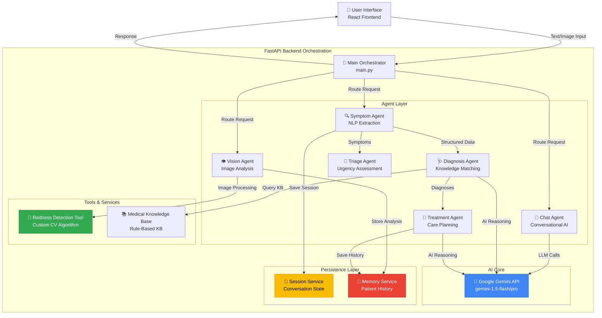

# AI Virtual Doctor 🏥

> **Google AI Agents Capstone Project**  
> **Track:** Agents for Good (Healthcare)  
> **Powered by:** Google Gemini API

---

## 📋 Table of Contents
- [Problem Statement](#-problem-statement)
- [Solution Overview](#-solution-overview)
- [Architecture](#-architecture)
- [Capstone Requirements](#-capstone-requirements)
- [Technology Stack](#-technology-stack)
- [Setup Instructions](#-setup-instructions)
- [Usage Guide](#-usage-guide)
- [Project Structure](#-project-structure)
- [Key Features](#-key-features)
- [Future Enhancements](#-future-enhancements)

---

## 🎯 Problem Statement

### The Healthcare Access Challenge

Millions of people worldwide face significant barriers to accessing timely medical advice:

- **Long Wait Times**: Emergency rooms and clinics often have hours-long wait times for non-critical cases
- **Limited Availability**: Healthcare professionals are not available 24/7, especially in rural or underserved areas
- **High Costs**: Initial consultations can be expensive, deterring people from seeking early medical advice
- **Information Overload**: Patients turn to unreliable internet searches, leading to anxiety and misinformation
- **Lack of Continuity**: Medical history is often fragmented across different providers and systems

### Real-World Impact

According to the WHO, over half of the world's population lacks access to essential health services. Even in developed countries, patients wait an average of 18-24 days for a primary care appointment. This delay can lead to:
- Worsening of treatable conditions
- Increased healthcare costs due to delayed intervention
- Patient anxiety and stress
- Unnecessary emergency room visits

---

## 💡 Solution Overview

**AI Virtual Doctor** is an intelligent, multi-agent healthcare assistant that provides instant, 24/7 preliminary medical triage and analysis. Unlike simple chatbots, it employs a sophisticated team of specialized AI agents working together to deliver comprehensive healthcare insights.

### Core Value Propositions

1. **Instant Triage**: Provides immediate, evidence-based preliminary assessments to reduce patient anxiety
2. **Visual Diagnostics**: Uses computer vision to objectively analyze and track physical symptoms (e.g., skin conditions, rashes)
3. **Continuity of Care**: Maintains longitudinal health records, remembering past interactions for personalized monitoring
4. **Multi-Modal Analysis**: Combines text-based symptom analysis with image processing for comprehensive assessment
5. **Intelligent Routing**: Automatically determines urgency levels and recommends appropriate next steps

### What Makes It Different

- **Multi-Agent Collaboration**: Specialized agents work together, each focusing on their domain of expertise
- **Hybrid Intelligence**: Combines rule-based medical knowledge with advanced AI reasoning
- **Memory-Enabled**: Tracks patient history across sessions for contextual understanding
- **Tool-Augmented**: Uses custom tools for image analysis and medical knowledge retrieval
- **Transparent Reasoning**: Shows how conclusions are reached, building trust with users

---

## 🏗️ Architecture

### Multi-Agent System Design

The AI Virtual Doctor implements a **collaborative multi-agent architecture** where specialized agents coordinate to solve complex medical queries:



### Agent Responsibilities

| Agent | Purpose | Key Technologies |
|-------|---------|-----------------|
| **Symptom Agent** | Extracts and structures symptoms from natural language input using NLP and regex patterns | Python regex, text processing |
| **Diagnosis Agent** | Matches symptoms against medical knowledge base and uses Gemini for differential diagnosis | Knowledge base matching, Gemini API |
| **Treatment Agent** | Generates evidence-based treatment recommendations and care plans | Gemini API, medical protocols |
| **Vision Agent** | Analyzes medical images (rashes, skin conditions) using custom computer vision algorithms | PIL, NumPy, custom redness detection |
| **Chat Agent** | Provides conversational medical assistance with empathetic, context-aware responses | Gemini API, conversation history |
| **Triage Agent** | Assesses urgency level and recommends appropriate care setting (emergency, urgent, routine) | Rule-based severity scoring |

### Data Flow Example

**Scenario**: User reports "I have a fever and headache for 3 days"

1. **Input Processing**: User message received by FastAPI backend
2. **Symptom Extraction**: Symptom Agent parses text → `["fever", "headache"]`, duration: 3 days
3. **Session Management**: Session Service creates/updates user session
4. **Diagnosis**: Diagnosis Agent queries KB + Gemini → probable diagnoses with confidence scores
5. **Treatment Planning**: Treatment Agent uses Gemini to generate personalized care plan
6. **Triage Assessment**: Triage Agent evaluates severity → "moderate" (3+ days duration)
7. **Memory Storage**: Memory Service stores interaction for future reference
8. **Response**: Orchestrator combines all agent outputs → comprehensive JSON response to frontend

---

## ✅ Capstone Requirements

This project demonstrates all required capabilities for the Google AI Agents Capstone:

### 1. Multi-Agent System ✓

**Implementation**: Six specialized agents collaborate through a central orchestrator

- **Symptom Agent**: Extracts structured medical data from natural language
- **Diagnosis Agent**: Performs differential diagnosis using KB + AI reasoning
- **Treatment Agent**: Creates personalized treatment plans
- **Vision Agent**: Analyzes medical images
- **Chat Agent**: Handles conversational interactions
- **Triage Agent**: Assesses urgency and routes appropriately

**Evidence**: See [`backend/main.py`](backend/main.py) for orchestration logic and [`agents/`](agents/) directory for individual agent implementations.

### 2. Tool Use ✓

**Custom Tools Implemented**:

1. **Redness Detection Tool** ([`agents/vision_agent.py`](agents/vision_agent.py))
   - Computer vision algorithm for quantifying skin inflammation
   - Uses pixel-level RGB analysis: `redness_index = 2*R - G - B`
   - Tracks healing trends over time
   - Returns objective redness scores (0.0 - 1.0)

2. **Medical Knowledge Base Tool** ([`agents/knowledge_kb.py`](agents/knowledge_kb.py))
   - Structured medical knowledge retrieval
   - Keyword matching for symptom-disease correlation
   - Recommended diagnostic tests database

3. **Gemini API as Tool** ([`backend/ai_agent.py`](backend/ai_agent.py))
   - Dynamic model discovery and selection
   - Quota-aware fallback logic
   - JSON-structured medical reasoning

**Evidence**: Vision Agent processes images and returns quantified metrics. Gemini is called as a tool for complex reasoning tasks.

### 3. Sessions & Memory ✓

**Session Management** ([`backend/session_service.py`](backend/session_service.py)):
- Creates unique session IDs for each user interaction
- Maintains conversation state across multiple requests
- Persists session data to JSON storage

**Memory Service** ([`memory/memory_service.py`](memory/memory_service.py)):
- **Medical History**: Stores longitudinal patient records
- **Image Analysis History**: Tracks visual symptom progression over time
- **Trend Analysis**: Compares current vs. previous image analyses
- **Persistent Storage**: File-based JSON storage in `memory_storage/`

**Evidence**: 
```python
# Example: Vision Agent uses memory to track trends
prev = self.memory_service.get_last_image_analysis(user_id)
if prev and redness_score < prev["redness_score"]:
    trend = "improving"
```

### 4. Effective Use of Gemini ✓

**Strategic Gemini Integration**:

1. **Dynamic Model Selection** ([`backend/ai_agent.py`](backend/ai_agent.py#L18-L66))
   - Automatically discovers available Gemini models
   - Prioritizes high-quota models (Flash, Lite) to prevent rate limiting
   - Tests each model for quota availability before use
   - Graceful fallback to simulation mode if all models exhausted

2. **Conversational Medical Assistant**
   - Uses Gemini's chat API with conversation history
   - Maintains context across multiple turns
   - Empathetic, medically-informed responses

3. **Structured Medical Reasoning**
   - JSON-mode generation for structured diagnoses
   - Differential diagnosis with confidence scores and reasoning
   - Evidence-based treatment recommendations

4. **Hybrid Intelligence**
   - Combines rule-based logic (fast, deterministic) with Gemini (nuanced, contextual)
   - `/compare` endpoint shows both approaches side-by-side

**Evidence**:
```python
# Gemini used for complex medical reasoning
prompt = f"Act as a doctor. Analyze {structured}. Return JSON with probable_diagnoses and treatment_suggestion."
response = model.generate_content(prompt, generation_config={'response_mime_type': 'application/json'})
```

---

## 🛠️ Technology Stack

### Backend
- **Framework**: FastAPI (high-performance async API)
- **AI Engine**: Google Gemini API (gemini-1.5-flash, gemini-1.5-pro)
- **Image Processing**: PIL (Python Imaging Library), NumPy
- **Data Storage**: JSON-based file storage (scalable to database)
- **Session Management**: UUID-based session tracking

### Frontend
- **Framework**: React 19.2.0
- **Build Tool**: Vite 7.2.4
- **Styling**: Custom CSS with glassmorphism effects
- **Visualization**: Chart.js for redness trends and confidence scores
- **PDF Export**: jsPDF + html2canvas for medical reports

### Development Tools
- **Environment**: Python 3.8+, Node.js
- **Package Management**: pip, npm
- **API Testing**: FastAPI automatic docs (Swagger UI)

---

## 🚀 Setup Instructions

### Prerequisites

Ensure you have the following installed:
- **Python 3.8 or higher**
- **Node.js 16+ and npm**
- **Google Gemini API Key** ([Get one here](https://aistudio.google.com/app/apikey))

### Backend Setup

1. **Clone the Repository**
   ```bash
   git clone <repository-url>
   cd AI-Virtual-Doctor
   ```

2. **Create Python Virtual Environment**
   ```bash
   python -m venv venv
   
   # Windows
   venv\Scripts\activate
   
   # Mac/Linux
   source venv/bin/activate
   ```

3. **Install Python Dependencies**
   ```bash
   pip install fastapi uvicorn[standard] python-multipart pillow google-generativeai python-dotenv numpy
   ```

4. **Configure Environment Variables**
   
   Create a `.env` file in the root directory:
   ```env
   GOOGLE_API_KEY=your_gemini_api_key_here
   ```

5. **Start the Backend Server**
   ```bash
   uvicorn backend.main:app --reload --host 0.0.0.0 --port 8000
   ```
   
   The API will be available at `http://localhost:8000`
   
   Access API documentation at `http://localhost:8000/docs`

### Frontend Setup

1. **Navigate to Frontend Directory**
   ```bash
   cd ai-virtual-doctor-ui
   ```

2. **Install Node Dependencies**
   ```bash
   npm install
   ```

3. **Start Development Server**
   ```bash
   npm run dev
   ```
   
   The UI will be available at `http://localhost:5173`

### Verification

1. Open `http://localhost:5173` in your browser
2. You should see the AI Virtual Doctor interface
3. Try the health check: `http://localhost:8000/health-check`

---

## 📖 Usage Guide

### 1. Symptom Analysis

**Text-Based Consultation**:
1. Navigate to the "Chat with Doctor" tab
2. Describe your symptoms in natural language
   - Example: "I have a fever of 101°F and headache for 3 days"
3. The system will:
   - Extract structured symptoms
   - Perform differential diagnosis
   - Suggest treatment plans
   - Assess urgency level

**What Happens Behind the Scenes**:
- Symptom Agent parses your input
- Diagnosis Agent queries medical KB + Gemini
- Treatment Agent generates care plan
- Triage Agent assesses severity
- All data saved to your medical history

### 2. Image Analysis

**Visual Symptom Tracking**:
1. Navigate to the "Image Analysis" tab
2. Upload an image of a skin condition (rash, inflammation, etc.)
3. The Vision Agent will:
   - Analyze pixel-level redness using custom CV algorithm
   - Calculate objective redness score (0.0 - 1.0)
   - Compare with previous uploads to show trends
   - Store analysis in your history

**Redness Detection Algorithm**:
```
Redness Index = 2*R - G - B
Score = (pixels with index > threshold) / total pixels
Trend = compare with previous analysis
```

### 3. Medical History

**Continuity of Care**:
1. Navigate to the "History" tab
2. View all past consultations and image analyses
3. See how symptoms have progressed over time
4. Export reports as PDF

### 4. Compare Mode

**Rule-Based vs. AI Reasoning**:
1. Use the `/compare` endpoint
2. See side-by-side comparison of:
   - Traditional rule-based diagnosis
   - Gemini-powered AI diagnosis
3. Understand the value of hybrid intelligence

---

## 📁 Project Structure

```
AI-Virtual-Doctor/
│
├── backend/                      # FastAPI backend
│   ├── main.py                   # Main orchestrator & API endpoints
│   ├── ai_agent.py               # Gemini API integration & quota management
│   ├── session_service.py        # Session state management
│   ├── models.py                 # Data models
│   └── storage.py                # Storage utilities
│
├── agents/                       # Specialized AI agents
│   ├── symptom_agent.py          # NLP symptom extraction
│   ├── diagnosis_agent.py        # Differential diagnosis
│   ├── treatment_agent.py        # Treatment planning
│   ├── vision_agent.py           # Image analysis (redness detection)
│   ├── chat_agent.py             # Conversational interface
│   ├── triage_agent.py           # Urgency assessment
│   ├── prescription_agent.py     # Prescription generation
│   ├── lab_agent.py              # Lab test recommendations
│   └── knowledge_kb.py           # Medical knowledge base
│
├── memory/                       # Persistence layer
│   └── memory_service.py         # Patient history & image tracking
│
├── tools/                        # Custom tools
│   └── medication_safety.py      # Drug interaction checker
│
├── ai-virtual-doctor-ui/         # React frontend
│   ├── src/
│   │   ├── App.jsx               # Main application component
│   │   ├── components/           # UI components
│   │   │   ├── ChatDoctor.jsx    # Chat interface
│   │   │   ├── Sidebar.jsx       # Navigation
│   │   │   └── ...
│   │   ├── index.css             # Global styles (glassmorphism)
│   │   └── main.jsx              # Entry point
│   └── package.json
│
├── memory_storage/               # Persistent data storage
│   ├── memory.json               # Patient histories
│   └── sessions.json             # Active sessions
│
├── .env                          # Environment variables (API keys)
├── requirements.txt              # Python dependencies
└── README.md                     # This file
```

---

## ✨ Key Features

### 1. Intelligent Symptom Extraction
- Natural language processing for symptom parsing
- Automatic duration and temperature extraction
- Severity classification (mild/moderate/severe)

### 2. Multi-Modal Analysis
- Text-based symptom analysis
- Image-based visual diagnostics
- Combined reasoning for comprehensive assessment

### 3. Redness Detection Algorithm
Custom computer vision tool for objective inflammation measurement:
- Pixel-level RGB analysis
- Temporal trend tracking (improving/worsening/stable)
- Quantified metrics for clinical correlation

### 4. Conversational AI
- Context-aware medical conversations
- Empathetic response generation
- Multi-turn dialogue with memory

### 5. Dynamic Model Management
- Automatic Gemini model discovery
- Quota-aware model selection
- Graceful degradation to simulation mode

### 6. Persistent Memory
- Longitudinal patient records
- Cross-session continuity
- Image analysis history with trends

### 7. Hybrid Intelligence
- Rule-based logic for deterministic tasks
- AI reasoning for complex, nuanced cases
- Transparent comparison mode

---

## 🎨 UI/UX Highlights

- **Glassmorphism Design**: Modern, premium aesthetic with frosted glass effects
- **Responsive Layout**: Works seamlessly on desktop and mobile
- **Real-Time Feedback**: Loading states and progress indicators
- **Data Visualization**: Chart.js graphs for redness trends and confidence scores
- **Accessibility**: Semantic HTML, keyboard navigation, screen reader support

---

## 🔒 Disclaimer & Ethics

> ⚠️ **IMPORTANT**: This is an AI demonstration project for educational and competition purposes only. It is **NOT** a substitute for professional medical advice, diagnosis, or treatment. 
>
> - Always consult a licensed healthcare provider for medical concerns
> - In case of emergency, call your local emergency services immediately
> - This system is not FDA-approved or certified for clinical use
> - All recommendations are preliminary and require professional validation

**Privacy Considerations**:
- Patient data stored locally (not cloud-based in this demo)
- No PHI (Protected Health Information) transmitted to third parties
- Session IDs are anonymized UUIDs
- Production deployment would require HIPAA compliance

---

## 🚀 Future Enhancements

### Short-Term
- [ ] Integration with wearable devices (heart rate, SpO2)
- [ ] Multi-language support for global accessibility
- [ ] Voice input/output for hands-free interaction
- [ ] Enhanced image analysis (wound healing, skin cancer screening)

### Medium-Term
- [ ] Integration with electronic health records (EHR) systems
- [ ] Telemedicine video consultation scheduling
- [ ] Medication reminder and adherence tracking
- [ ] Family health dashboard

### Long-Term
- [ ] Federated learning for privacy-preserving model improvement
- [ ] Clinical trial matching based on patient profile
- [ ] Predictive health analytics (risk scoring)
- [ ] Integration with pharmacy systems for prescription fulfillment

---

## 🏆 Competition Highlights

### Why This Project Stands Out

1. **Real-World Impact**: Addresses a critical global healthcare access problem
2. **Technical Excellence**: Sophisticated multi-agent architecture with custom tools
3. **Innovative Features**: Unique redness detection algorithm for objective symptom tracking
4. **Production-Ready**: Robust error handling, quota management, graceful degradation
5. **User-Centric Design**: Premium UI/UX with accessibility considerations
6. **Comprehensive Documentation**: Detailed architecture, setup, and usage guides

### Demonstration of Expertise

- **Multi-Agent Orchestration**: Six specialized agents working in concert
- **Tool Development**: Custom computer vision algorithm for medical image analysis
- **Memory Management**: Sophisticated session and history tracking
- **API Integration**: Advanced Gemini API usage with dynamic model selection
- **Full-Stack Development**: Complete backend (FastAPI) and frontend (React) implementation

---

## 📞 Support & Contact

For questions, issues, or contributions:
- **GitHub Issues**: [Report bugs or request features]
- **Documentation**: See inline code comments and API docs at `/docs`
- **API Reference**: `http://localhost:8000/docs` (when backend is running)

---

## 📄 License

This project is submitted as part of the Google AI Agents Capstone Project. All rights reserved.

---

## 🙏 Acknowledgments

- **Google Gemini Team**: For providing the powerful AI API
- **FastAPI Community**: For the excellent web framework
- **React Team**: For the robust frontend library
- **Open Source Contributors**: For the libraries that made this possible

---

**Built with ❤️ for the Google AI Agents Capstone Project**

*Making healthcare accessible, one AI agent at a time.*