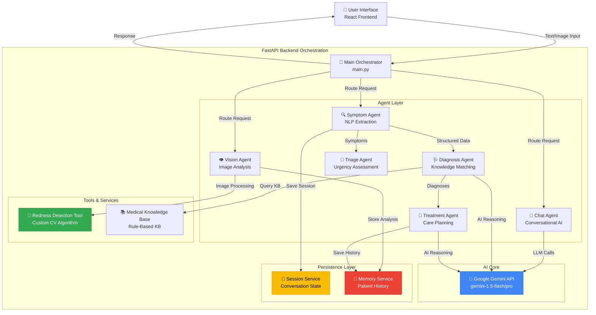

# AI Virtual Doctor 🏥

> **Advanced Multi-Agent Healthcare Assistant**
> **Track:** Healthcare / Agents for Good
> **Powered by:** Google Gemini API

---

## 📋 Table of Contents
- [Problem Statement](#-problem-statement)
- [Solution Overview](#-solution-overview)
- [Architecture](#-architecture)
- [Core Architecture Features](#-core-architecture-features)
- [Technology Stack](#-technology-stack)
- [Setup Instructions](#-setup-instructions)
- [Usage Guide](#-usage-guide)
- [Project Structure](#-project-structure)
- [Key Features](#-key-features)

---

## 🎯 Problem Statement

Millions worldwide face barriers to timely medical advice: long wait times (18-24 days average for primary care), limited 24/7 availability in rural areas, high consultation costs, unreliable internet health information, and fragmented medical records. According to WHO, over half the global population lacks access to essential health services, leading to worsening conditions, increased costs, anxiety, and unnecessary ER visits.

---

## 💡 Solution Overview

**AI Virtual Doctor** is an intelligent multi-agent healthcare assistant providing instant, 24/7 preliminary medical triage. It employs specialized AI agents for comprehensive healthcare insights:

- **Instant Triage**: Evidence-based preliminary assessments
- **Visual Diagnostics**: Computer vision for tracking skin conditions and rashes
- **Continuity of Care**: Longitudinal health records with memory
- **Multi-Modal Analysis**: Combined text and image processing
- **Intelligent Routing**: Automated urgency assessment

**Key Differentiators**: Multi-agent collaboration, hybrid rule-based + AI reasoning, cross-session memory, custom CV tools, and transparent decision-making.

---

## 🏗️ Architecture

### Multi-Agent System Design

The AI Virtual Doctor implements a **collaborative multi-agent architecture** where specialized agents coordinate to solve complex medical queries:



### Agent Responsibilities

| Agent | Purpose | Key Technologies |
|-------|---------|-----------------|
| **Symptom Agent** | Extracts and structures symptoms from natural language | Python regex, NLP |
| **Diagnosis Agent** | Differential diagnosis using KB + Gemini | Knowledge base, Gemini API |
| **Treatment Agent** | Evidence-based treatment recommendations | Gemini API, medical protocols |
| **Vision Agent** | Analyzes medical images (rashes, skin conditions) | PIL, NumPy, custom CV |
| **Chat Agent** | Conversational medical assistance | Gemini API, conversation history |
| **Triage Agent** | Assesses urgency and recommends care setting | Rule-based severity scoring |

---

## ✅ Core Architecture Features

### 1. Multi-Agent System ✓

Six specialized agents (Symptom, Diagnosis, Treatment, Vision, Chat, Triage) collaborate through a central orchestrator. See [`backend/main.py`](backend/main.py) and [`agents/`](agents/) directory.

### 2. Tool Use ✓

**Custom Tools**:
- **Redness Detection** ([`agents/vision_agent.py`](agents/vision_agent.py)): CV algorithm using `redness_index = 2*R - G - B`, tracks healing trends
- **Medical Knowledge Base** ([`agents/knowledge_kb.py`](agents/knowledge_kb.py)): Symptom-disease correlation, diagnostic tests
- **Gemini API** ([`backend/ai_agent.py`](backend/ai_agent.py)): Dynamic model discovery, quota-aware selection, JSON-structured reasoning

### 3. Sessions & Memory ✓

**Session Management** ([`backend/session_service.py`](backend/session_service.py)): UUID-based session tracking, conversation state persistence

**Memory Service** ([`memory/memory_service.py`](memory/memory_service.py)): Longitudinal patient records, image analysis history, trend analysis

```python
# Vision Agent tracks trends using memory
prev = self.memory_service.get_last_image_analysis(user_id)
if prev and redness_score < prev["redness_score"]:
    trend = "improving"
```

### 4. Effective Use of Gemini ✓

- **Dynamic Model Selection**: Auto-discovers models, prioritizes high-quota options, graceful fallback
- **Conversational AI**: Chat API with multi-turn context
- **Structured Reasoning**: JSON-mode for diagnoses with confidence scores
- **Hybrid Intelligence**: Combines rule-based + AI reasoning

---

## 🛠️ Technology Stack

**Backend**: FastAPI, Google Gemini API (gemini-1.5-flash/pro), PIL, NumPy, JSON storage  
**Frontend**: React 19.2.0, Vite 7.2.4, Chart.js, jsPDF, custom CSS with glassmorphism  
**Tools**: Python 3.8+, Node.js, pip, npm

---

## 🚀 Setup Instructions

### Prerequisites
- Python 3.8+, Node.js 16+, npm
- **Google Gemini API Key** ([Get one here](https://aistudio.google.com/app/apikey))

### Backend Setup

```bash
# Clone and navigate
git clone <repository-url>
cd AI-Virtual-Doctor

# Create virtual environment
python -m venv venv
venv\Scripts\activate  # Windows
source venv/bin/activate  # Mac/Linux

# Install dependencies
pip install fastapi uvicorn[standard] python-multipart pillow google-generativeai python-dotenv numpy

# Create .env file with your API key
echo "GOOGLE_API_KEY=your_gemini_api_key_here" > .env

# Start backend
uvicorn backend.main:app --reload --host 0.0.0.0 --port 8000
```

API: `http://localhost:8000` | Docs: `http://localhost:8000/docs`

### Frontend Setup

```bash
cd ai-virtual-doctor-ui
npm install
npm run dev
```

UI: `http://localhost:5173`

---

## 📖 Usage Guide

**Symptom Analysis**: Describe symptoms in natural language (e.g., "fever of 101°F and headache for 3 days"). System extracts symptoms, performs differential diagnosis via KB + Gemini, generates treatment plans, and assesses urgency.

**Image Analysis**: Upload skin condition images. Vision Agent analyzes pixel-level redness (`redness_index = 2*R - G - B`), calculates objective scores (0.0-1.0), tracks trends vs. previous uploads.

**Medical History**: View past consultations, image analyses, symptom progression, export PDF reports.

**Compare Mode**: Use `/compare` endpoint for side-by-side rule-based vs. Gemini-powered AI diagnosis.

---

## 📁 Project Structure

```
AI-Virtual-Doctor/
│
├── backend/                      # FastAPI backend
│   ├── main.py                   # Main orchestrator & API endpoints
│   ├── ai_agent.py               # Gemini API integration & quota management
│   ├── session_service.py        # Session state management
│   └── models.py                 # Data models
│
├── agents/                       # Specialized AI agents
│   ├── symptom_agent.py          # NLP symptom extraction
│   ├── diagnosis_agent.py        # Differential diagnosis
│   ├── treatment_agent.py        # Treatment planning
│   ├── vision_agent.py           # Image analysis (redness detection)
│   ├── chat_agent.py             # Conversational interface
│   ├── triage_agent.py           # Urgency assessment
│   └── knowledge_kb.py           # Medical knowledge base
│
├── memory/                       # Persistence layer
│   └── memory_service.py         # Patient history & image tracking
│
├── ai-virtual-doctor-ui/         # React frontend
│   ├── src/
│   │   ├── App.jsx               # Main application
│   │   ├── components/           # UI components
│   │   └── index.css             # Global styles (glassmorphism)
│   └── package.json
│
├── memory_storage/               # Persistent data
│   ├── memory.json               # Patient histories
│   └── sessions.json             # Active sessions
│
├── .env                          # Environment variables (API keys)
└── README.md                     # This file
```

---

## ✨ Key Features

- **Intelligent Symptom Extraction**: NLP parsing, automatic duration/temperature extraction, severity classification
- **Multi-Modal Analysis**: Combined text + image diagnostics
- **Redness Detection**: Custom CV algorithm with pixel-level RGB analysis and temporal trend tracking
- **Conversational AI**: Context-aware, empathetic multi-turn dialogue with memory
- **Dynamic Model Management**: Auto-discovery, quota-aware selection, graceful degradation
- **Persistent Memory**: Longitudinal records, cross-session continuity, image history
- **Hybrid Intelligence**: Rule-based + AI reasoning with transparent comparison
- **Premium UI/UX**: Glassmorphism design, responsive layout, Chart.js visualizations, accessibility support

---

## 🔒 Disclaimer

> ⚠️ **IMPORTANT**: Educational demonstration only. NOT a substitute for professional medical advice. Always consult licensed healthcare providers. In emergencies, call local emergency services. Not FDA-approved for clinical use.

**Privacy**: Local storage only, anonymized session IDs. Production deployment requires HIPAA compliance.

---

## 🚀 Future Enhancements

- Wearable device integration (heart rate, SpO2)
- Multi-language support, voice I/O
- Enhanced image analysis (wound healing, skin cancer screening)
- EHR integration, telemedicine scheduling
- Medication reminders, family health dashboard
- Federated learning, clinical trial matching
- Predictive analytics, pharmacy integration

---

**Built with ❤️ using Google Gemini API**

*Making healthcare accessible, one AI agent at a time.*
