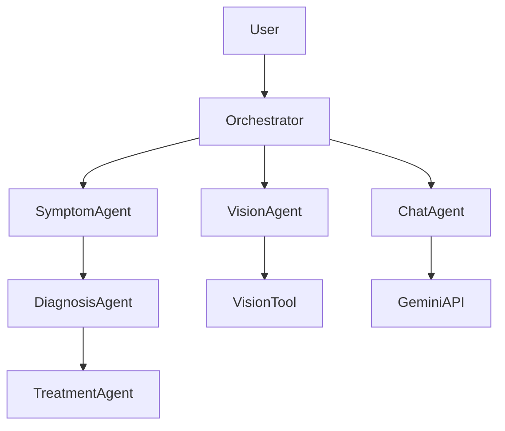

# AI Virtual Doctor: From Prompt Engineering to Agentic Workflows

*This is a submission for the [Google AI Agents Writing Challenge](https://dev.to/challenges/googlekagglechallenge): Capstone Showcase*

## My Learning Journey / Project Overview

Participating in the **5-Day AI Agents Intensive Course with Google and Kaggle** was a transformative experience. Before this course, I viewed Large Language Models (LLMs) primarily as sophisticated chatbots—tools for generating text or code. However, diving deep into agentic workflows, tool use, and multi-agent orchestration completely shifted my perspective. I realized that the future of AI isn't just about *saying* things, but about *doing* things.

For my capstone project, I built **AI Virtual Doctor**, an intelligent multi-agent healthcare assistant designed to provide instant, 24/7 preliminary medical triage.

**The Problem**: Millions worldwide face barriers to timely medical advice—long wait times, limited availability, and high costs.
**The Solution**: An AI system that employs specialized agents to provide evidence-based preliminary assessments, visual diagnostics for skin conditions, and longitudinal health tracking.

## Key Concepts / Technical Deep Dive

### 1. Multi-Agent Architecture
Instead of a single "do-it-all" prompt, I implemented a **collaborative multi-agent architecture**. In healthcare, you have specialists; my system reflects that.

*   **Symptom Agent**: Extracts structured data from natural language.
*   **Diagnosis Agent**: Uses medical knowledge to form hypotheses.
*   **Vision Agent**: Analyzes medical images using computer vision.
*   **Triage Agent**: Strictly assesses urgency for safety.

### 2. Tools & "Vision"
The course emphasized that agents need tools. My **Vision Agent** uses a custom Python tool (using PIL/NumPy) to calculate a "Redness Index" (`2*R - G - B`) from skin images. This gives the agent objective data to track healing progress over time, rather than just hallucinating a description.

### 3. Memory & Persistence
A doctor needs to know your history. I built a `MemoryService` that persists conversation state and image analysis results. This allows the system to detect trends (e.g., "Your inflammation has decreased by 20% since yesterday").

### 4. Hybrid Intelligence
Pure LLMs can hallucinate. My system uses a **Hybrid Approach**, combining the creative reasoning of **Gemini 1.5 Pro** with a deterministic **Medical Knowledge Base**. This ensures critical triage decisions are safe and grounded in protocol.

## Reflections & Takeaways

The AI Agents Intensive Course moved me from "prompt engineering" to "agent engineering." I learned that:
*   **Specialization beats Generalization**: Small, focused agents perform better than one massive prompt.
*   **Context is King**: Memory and state management are what turn a chatbot into a true assistant.
*   **Safety First**: In domains like healthcare, hybrid systems (Rules + AI) are essential.

Building **AI Virtual Doctor** showed me that with the right architecture, we can build systems that are not only intelligent but also safe, helpful, and deeply impactful. I'm excited to continue exploring the frontier of agentic AI!
